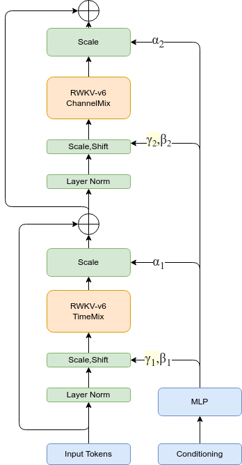
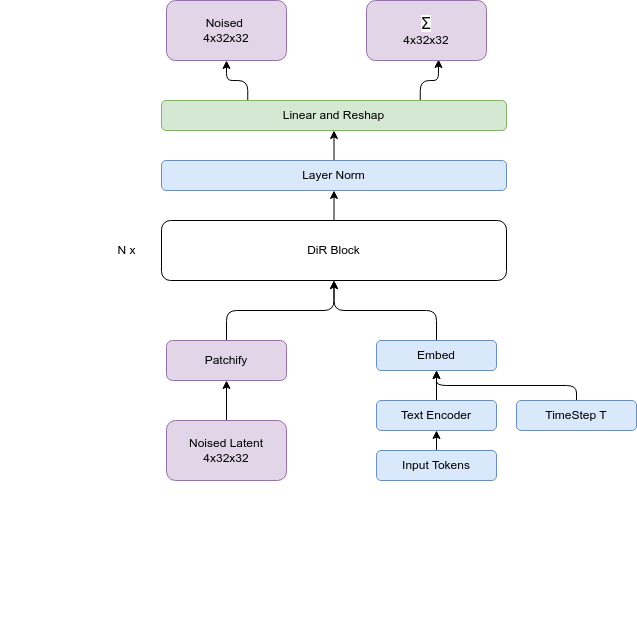

# Di-R
Diffusion with RWKV

## Replace Transformer with RWKV-v6 block

This project is to replace the transformer in the original Di-R with RWKV-v6 block.

### RWKV-v6 block
RWKV-v6 block is a RNN-like block with a large number of parameters. It can be used to replace the transformer in the original Di-R.

### Model architecture

The original DiT model architecture is as follows:


We just replace the DiT Block to DiR Block.



We also use a 12 layers RWKV model to encode the input tokens. The whole model architecture is as follows:


### Training

The training depends on Deepspeed with Zero-2 with CPU offload strategy. The following is the training arguments:

| Argument | Data type | Defual value | Description |
| --- | --- | --- | --- |
| `--data-path` | str | '/media/yueyulin/TOUROS/images/laion400m_zip' | data directory, organized as zip files |
| `--results-dir` | str | 'results' | The directory to save result models |
| `--model` | str | 'DiRwkv_XL_2' | Model names, values are `DiRwkv_models.keys()` |
| `--image-size` | int | 256 | Image size [256, 512] |
| `--epochs` | int | 1400 | Training epoches |
| `--global-batch-size` | int | 8 | This is actually per GPU batch size |
| `--global-seed` | int | 0 | Seed |
| `--vae` | str | 'ema' | VAE Type ['ema', 'mse'] |
| `--num-workers` | int | 4 | Num of data loader's workers |
| `--is-zip` | bool | True | If data is zip files |
| `--is-pos-emb` | bool | False | If X is added with pos embeddings |
| `--devices` | int | 1 | Number of gpus |
| `--num_nodes` | int | 1 | Number of nodes |
| `--log_every_n_steps` | int | 10000 | Number of steps to save model |

#### Enviornments

Conda environments:

```
conda create -n di_r python=3.10
conda activate di_r
conda install cuda -c nvidia/label/cuda-12.1.0
```
Cuda has to be 12.1 for now because deepspeed is currently compiled by CUDA 12.1.


Python environments:
```
accelerate==0.27.2
aiohttp==3.9.3
aiosignal==1.3.1
annotated-types==0.6.0
async-timeout==4.0.3
attrs==21.4.0
cbor2==5.6.2
certifi==2024.2.2
charset-normalizer==3.3.2
deepspeed==0.14.0
diffuser==0.0.1
diffusers==0.26.3
diffusion==6.10.2
diffusion-core==0.0.65
filelock==3.13.1
frozenlist==1.4.1
fsspec==2024.2.0
hjson==3.1.0
huggingface-hub==0.21.4
idna==3.6
importlib_metadata==7.0.2
Jinja2==3.1.3
joblib==1.3.2
lightning==2.2.1
lightning-utilities==0.10.1
MarkupSafe==2.1.5
maturin==1.5.0
mpmath==1.3.0
multidict==6.0.5
networkx==3.2.1
ninja==1.11.1.1
numpy==1.26.4
nvidia-cublas-cu12==12.1.3.1
nvidia-cuda-cupti-cu12==12.1.105
nvidia-cuda-nvrtc-cu12==12.1.105
nvidia-cuda-runtime-cu12==12.1.105
nvidia-cudnn-cu12==8.9.2.26
nvidia-cufft-cu12==11.0.2.54
nvidia-curand-cu12==10.3.2.106
nvidia-cusolver-cu12==11.4.5.107
nvidia-cusparse-cu12==12.1.0.106
nvidia-nccl-cu12==2.19.3
nvidia-nvjitlink-cu12==12.4.99
nvidia-nvtx-cu12==12.1.105
packaging==24.0
pandas==2.2.1
pillow==10.2.0
psutil==5.9.8
py-cpuinfo==9.0.0
pydantic==2.6.3
pydantic_core==2.16.3
pynvml==11.5.0
python-dateutil==2.9.0.post0
pytorch-lightning==2.2.1
pytz==2024.1
PyYAML==6.0.1
regex==2023.12.25
requests==2.31.0
safetensors==0.4.2
scikit-learn==1.4.1.post1
scipy==1.12.0
sentence-transformers==2.5.1
six==1.16.0
stringcase==1.2.0
structlog==21.5.0
sympy==1.12
threadpoolctl==3.3.0
timm==0.9.16
tokenizers==0.15.2
toml==0.10.2
tomli==2.0.1
torch==2.2.1
torchmetrics==1.3.1
torchvision==0.17.1
tqdm==4.66.2
transformers==4.38.2
triton==2.2.0
typing_extensions==4.10.0
tzdata==2024.1
urllib3==2.2.1
wandb==0.16.4
yarl==1.9.4
zipp==3.17.0
```
 Install customized zip reader:
 ```
 cd data/rs/zip_fast_reader
 maturin develop
 ```

 #### Download data and extract data
 The data is downloaded from Baidu Cloud. After extracting the data, we assume the data is extracted in ZIP_ROOT. The data structure looks like:

 The baidu cloud link is :

 链接: https://pan.baidu.com/s/1VkZ_3zjCW06X0MNIvsWtsQ?pwd=xypd 提取码: xypd 
--来自百度网盘超级会员v6的分享


 ```
 ZIP_ROOT_
     |-- batch0/
     |-- batch1/
     |-- batch2/
     |-- ...
     |-- batch18/
     |-- meta.txt
 ```

meta.txt contains all the information which line include zip_file's relative path, the image file name in zip file and captioned txt file in zip file. We use a customized zip dataset to read data directly in zip file to save disk io sacrificed with CPU usage. Furthermore we can split the meta.txt into slices to enable multiple nodes data distribution.


#### Training script

According to the above data structure and the script arguments, the training script is as follows:

The following script is used to train the model with batch 24 and no pos embedding.

```
python train_all_deepspeed.py --results-dir $model_output_path --data-path $ZIP_ROOT --global-batch-size 24
```

The following script is used to train the model with batch 24 and pos embedding.
```
python train_all_deepspeed.py --results-dir $model_output_path --data-path $ZIP_ROOT --global-batch-size 24 --is-pos-emb
```

Since all of the images' resolution is 256x256, the maxium patches is 64, so we can enlarge the batch size to train the model.

#### Training with ImageNet plus skip connection and residual connection
Following the https://github.com/feizc/DiS , I add the skip connection and residual connection to the model.
To train with ImageNet, I use the following script:
```
python train_all_deepspeed_v1.py --global-batch-size 20
```

In this version, both ema and model will be saved.

#### Training with open_clip text encoder puls skip connection and residual connection

Requirement:
Install open_clip
```
pip install open_clip_torch
```

Train model using the following script:
```
python train_all_deepspeed_v2.py --results-dir $model_output_path --data-path $ZIP_ROOT --global-batch-size 24
```

### Inference script

The sample.py is used to generate the sample images.

The arguments are as follows:


| Argument                | Data type   | Default value              | Description                           |
|---------------------|--------|---------------------|--------------------------------|
| --model             | str    | 'DiRwkv_XL_2'       |Model types |
| --vae               | str    | 'ema'               | VAE  ['ema', 'mse'] |
| --image-size        | int    | 256                 | Image size [256, 512]     |
| --cfg-scale         | float  | 7                   | Conditional factor                        |
| --num-sampling-steps| int    | 250                 | Sampling steps                        |
| --seed              | int    | 0                   | Seed                        |
| --ckpt              | str    | '/media/yueyulin/KINGSTON/tmp/DiRwkv_XL_2/epoch_0_step_20000/model.pth' | model ckpt path |
| --is-pos-emb        | bool   | False               | If pos-emb is enabled                 |


## TODO
 - Distributed training
 - Large image size support
